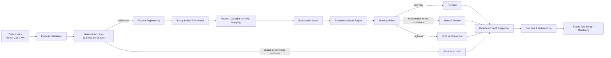

# ClaimShield AI — Pre-Submission RCM Denial Prevention Engine

[](https://vit.ac.in)
[](https://github.com)
[](https://python.org)
[](https://fastapi.tiangolo.com)
[](https://react.dev)
[](https://pytest.org)

> **ClaimShield AI** is an intelligent pre-submission revenue cycle management (RCM) prevention engine. It intercepts preventable healthcare claim denials **before transmission**, identifies the most probable Claim Adjustment Reason Code (CARC), explains major risk factors in billing-specialist language, provides an interactive counterfactual "What-If" remediation simulator, and deterministically routes claims to `RELEASE`, `REVIEW`, `HOLD_FOR_CORRECTION`, or `BLOCK_UNTIL_VALID`.

---

## ⚠️ Mandatory Synthetic Data Honesty Disclosure

> **SIMULATED / DEMO DATA ONLY**
> 
> - **Zero Real Patient Data**: No Protected Health Information (PHI) or real patient records were used.
> - **Zero Real Payer Data**: No proprietary commercial or government payer records were ingested.
> - **No Real Claims Transmitted**: No claims were submitted to real clearinghouses, Medicare/Medicaid, or private health plans.
> - **Internal Simulated Validation**: Reported model metrics (76.0% accuracy, 0.818 ROC-AUC) reflect validation on synthetic data with 5% controlled label noise.
> - **Illustrative Financial Impact**: Projected rework savings are illustrative projections based on stated industry benchmarks (\$25.00 average denial appeal cost).
> - **Non-Clinical Prototype**: This system is not clinically validated or payer-certified.

---

## 1. Product Story & Value Proposition

### The Problem
Healthcare providers traditionally discover billing defects **30 to 60 days post-submission**, when an Electronic Remittance Advice (ERA / X12 835) returns with denial codes. This delay triggers avoidable administrative rework (\$25/claim), deferred reimbursement (~32 days), and bad-debt write-offs.

### The ClaimShield Solution
ClaimShield AI shifts intelligence upstream before electronic claim generation:
```text
Claim Intake ──► Deterministic Validation ──► Feature Engineering ──► Denial Scoring ──► CARC Prediction ──► Explainability ──► Remediation ──► Routing Policy
```
> *"We do not wait for the payer to tell us why a claim failed. We identify preventable risk before submission and tell the biller what to fix."*

---

## 2. Architecture



---

## 3. CARC Denial Taxonomy (Supported Categories)

| Code | Plain-Language Meaning | Pre-Submission Remediation Action |
|---|---|---|
| **CO-16** | Required info missing or documentation incomplete | Attach missing clinical encounter notes / operative report (PWK segment). |
| **CO-18** | Exact duplicate claim or service line | Search clearinghouse transaction history; suppress duplicate submission. |
| **CO-27** | Inactive coverage / policy termination | Execute real-time 270/271 transaction to verify coverage for date of service. |
| **CO-29** | Timely-filing limit expired or at risk | Audit service date against payer filing window (90–365 days); expedite filing. |
| **CO-50** | Medical necessity mismatch | Verify diagnosis supports procedure level under LCD/NCD guidelines. |
| **CO-96** | Non-covered procedure under plan policy | Check benefit schedule; obtain executed Advance Beneficiary Notice (ABN). |
| **CO-97** | Bundled procedure under NCCI edits | Review NCCI edits; attach modifier -59 or -25 only if clinically distinct. |
| **CO-197** | Pre-authorization required but absent | Verify payer auth list; secure pre-certification number for Box 23 / Loop 2300. |

---

## 4. Quick Start & Exact Commands

The prototype runs **100% locally and offline** with zero external API keys or cloud dependencies.

### Step 1: Clone or Navigate to Directory
```powershell
cd "C:\Users\Dharsan P\.gemini\antigravity\scratch\claimshield-ai"
```

### Step 2: Install Backend Dependencies
```powershell
python -m pip install -r requirements.txt
```

### Step 3: Install Frontend Dependencies
```powershell
cd frontend
npm install
cd ..
```

### Step 4: Generate Synthetic Dataset & Train Models
Generates 4,000 synthetic records (`seed=42`), executes leakage audit, trains dual-stage models, and serializes artifacts:
```powershell
python -m backend.ml.train
```

### Step 5: Run Automated Tests (17 Test Cases)
Verifies validation rules, leakage prevention, feature pipelines, and API routes:
```powershell
python -m pytest -v tests
```

### Step 6: Start Backend API (FastAPI)
```powershell
python -m uvicorn backend.main:app --host 127.0.0.1 --port 8000 --reload
```
API Documentation will be available at: `http://127.0.0.1:8000/docs`
Health check: `http://127.0.0.1:8000/health`

### Step 7: Start Frontend Dashboard (React + Vite)
In a second terminal:
```powershell
cd frontend
npm run dev
```
Open your browser at: `http://localhost:5173`

---

## 5. The 3-Minute Live Demo Flow

1. **Open Dashboard**: Note the persistent `SIMULATED / DEMO DATA` badge and MIC VIT Chennai hackathon branding.
2. **Select Preset 1 (High Risk Auth)**: Click *"High Risk: Knee Arthroscopy (Missing Pre-Auth)"*.
3. **Analyze Before Submission**: Observe:
   - Semicircular Probability Gauge showing **88% Denial Probability**.
   - Routing Banner: **`HOLD_FOR_CORRECTION`**.
   - Predicted CARC: **`CO-197` (Pre-Authorization Missing)** with 85% confidence.
   - Top Risk Driver: Missing prior authorization for surgical procedure CPT 29881.
   - Actionable Advice: *"Obtain prior authorization number and populate Box 23..."*
4. **Interactive "What-If" Simulation**:
   - Scroll to the What-If Simulator panel.
   - Toggle **Prior Authorization: Checked**.
   - Click **"Recalculate Impact of Remediation"**.
   - Watch the score drop live from **88% to 11% (-77% risk delta)** and routing flip to **`RELEASE`**!
5. **Inspect the Queue**: Click the **"Pre-Submission Queue"** tab to view historical claims, filter by risk tier, and log simulated payer remittance outcomes.
6. **Model Transparency & ROI**: Click the **"Model Transparency & ROI"** tab to view the confusion matrix, held-out test metrics, payer benchmarks, and interactive hospital ROI calculator.
7. **Batch Screening**: Click **"Batch Analysis"** to evaluate a batch of claims simultaneously and calculate total at-risk dollars held.

---

## 6. Privacy & Production Boundary Specification

- **De-Identification**: All synthetic identifiers (`CLM_XXXXXX`, `PAT_XXXXX`) are opaque hashes without real names, dates of birth, or social security numbers.
- **Audit Logging**: Application logs record event type, claim ID, model version, and routing status without printing patient payloads or internal stack traces.
- **Production Integration Path**:
  - **EDI Ingestion**: Standard ANSI X12 837P/837I parser integration.
  - **Adjudication Feeds**: Automated X12 835 ERA ingestion for continuous model monitoring and drift tracking.
  - **Compliance Architecture**: TLS 1.3 encryption in transit, AES-256 at rest, OAuth2/OIDC provider authentication, and HIPAA Business Associate Agreement (BAA) isolation.

---

## 7. Project Structure

```text
claimshield-ai/
├── README.md
├── requirements.txt
├── package.json
├── .env.example
├── .gitignore
├── docs/
│   ├── architecture.md
│   ├── demo_script_3min.md
│   ├── rcm_domain_guide.md
│   └── evaluation_report.md
├── data/
│   └── synthetic_claims.csv
├── backend/
│   ├── config.py
│   ├── database.py
│   ├── main.py
│   ├── models/
│   │   ├── db_models.py
│   │   └── schemas.py
│   ├── ml/
│   │   ├── generator.py
│   │   ├── preprocessor.py
│   │   ├── train.py
│   │   ├── predictor.py
│   │   ├── explainer.py
│   │   └── artifacts/
│   ├── services/
│   │   ├── validator.py
│   │   ├── routing_policy.py
│   │   ├── claim_service.py
│   │   └── metrics_service.py
│   └── routers/
│       ├── predict.py
│       ├── claims.py
│       ├── outcomes.py
│       └── reference.py
├── frontend/
│   ├── package.json
│   ├── vite.config.js
│   ├── tailwind.config.js
│   └── src/
│       ├── App.jsx
│       ├── components/
│       │   ├── Header.jsx
│       │   ├── Tabs.jsx
│       │   ├── Studio/
│       │   ├── Queue/
│       │   ├── Intelligence/
│       │   └── Batch/
│       └── data/
│           └── samplePresets.js
└── tests/
    ├── conftest.py
    ├── test_leakage.py
    ├── test_validation.py
    ├── test_features.py
    ├── test_models.py
    └── test_api.py
```
