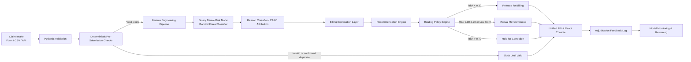

# ClaimShield AI — Pre-Submission RCM Denial Prevention Engine

> **Microsoft Innovation Club, VIT Chennai — Hackathon Prototype**  
> **Target Track:** Healthcare AI / Revenue Cycle Management (RCM)  
> **Status:** Local Working Prototype (`SIMULATED / DEMO DATA`)

---

## ⚠️ Synthetic Data Honesty & Clinical Boundary Notice

> [!IMPORTANT]
> **SIMULATED / DEMO DATA ONLY**  
> - **Zero Real Patient Data:** No Protected Health Information (PHI) or real patient records were used.
> - **Zero Real Payer Data:** No commercial or CMS payer systems were accessed or queried.
> - **Zero Live Submissions:** No electronic claim was transmitted to clearinghouses or payers.
> - **Validation Boundary:** Model performance metrics (ROC-AUC, Precision, Recall, Confusion Matrix) represent internal holdout evaluation on mathematically simulated data (`RANDOM_SEED=42`).
> - **Illustrative Economics:** Protected dollar figures and rework reduction percentages are illustrative financial projections.
> - **Not Certified:** This software is a student hackathon demonstration prototype and is **not clinically validated or payer-certified**.

---

## 1. Product Vision & Story

### The RCM Problem
In US healthcare revenue cycle management, hospitals and physician practices discover billing errors and policy mismatches **only after payer adjudication** (typically 30–90 days post-service). Key preventable causes include:
- Missing mandatory prior authorizations (CARC `CO-197`)
- Expired or unverified patient coverage (CARC `CO-27`)
- Timely-filing statutory deadlines exceeded (CARC `CO-29`)
- Duplicate claim submissions (CARC `CO-18`)
- Incomplete clinical documentation / missing charts (CARC `CO-16`)
- Diagnosis-to-procedure medical necessity mismatches (CARC `CO-50`)
- NCCI column 1 / column 2 unbundling edits (CARC `CO-97`)
- Non-covered plan service charges (CARC `CO-96`)

This causes avoidable cash-flow delays, costly administrative rework (\$25–\$118 per appealed claim), and unnecessary claim write-offs.

### The ClaimShield AI Solution
ClaimShield AI acts as an **upstream pre-submission intelligence guardrail**:
```text
Claim Intake
  → Deterministic Validation (Hard Schema / Duplicate / Sanity Checks)
  → Feature Engineering (Zero Post-Submission Leakage)
  → Dual-Stage ML Prediction (Denial Risk Probability)
  → CARC Reason Attribution (CO-16, CO-18, CO-27, CO-29, CO-50, CO-96, CO-97, CO-197)
  → Billing Explanation Layer (Plain-language risk drivers)
  → Actionable Corrective Recommendation
  → Automated Routing (RELEASE, REVIEW, HOLD_FOR_CORRECTION, BLOCK_UNTIL_VALID)
```

> **"We do not wait for the payer to tell us why a claim failed. We identify preventable risk before submission and tell the biller what to fix."**

---

## 2. Architecture & Dataflow



### Key Architectural Principles
1. **Deterministic vs. Probabilistic Separation**: Syntax flaws, negative amounts, future dates, and confirmed duplicate IDs are intercepted as `BLOCK_UNTIL_VALID` prior to ML inference.
2. **Dual-Stage Machine Learning**:
   - **Stage 1**: Calibrated `RandomForestClassifier` predicting continuous denial probability `[0.0, 1.0]`.
   - **Stage 2**: CARC reason attribution model mapping clinical and administrative risk vectors to the 8 standard reason codes.
3. **No Unsafe Autonomous Rejection**: Claims are routed to `RELEASE`, `REVIEW`, `HOLD_FOR_CORRECTION`, or `BLOCK_UNTIL_VALID`. No claim is permanently discarded without human review.
4. **Billing Team Language**: Feature importances are translated into clinical terms (e.g. `prior_auth_flag=False` $\to$ "Prior authorization missing for authorization-required surgical service").

---

## 3. Technology Stack

- **Backend**: Python 3.11+ / 3.14, FastAPI, Uvicorn, Pydantic v2, SQLAlchemy 2.0, SQLite
- **Machine Learning**: scikit-learn, joblib, pandas, NumPy, SciPy
- **Frontend**: React 18, Vite 5, Tailwind CSS, Lucide React, Recharts
- **Testing**: pytest, pytest-cov, httpx

---

## 4. Quickstart & Installation (Fully Local)

### Prerequisites
- Python 3.11+ (tested on Python 3.11 – 3.14)
- Node.js 18+ and npm

### 1. Backend Setup
```bash
# Navigate to backend directory
cd backend

# Install dependencies
python -m pip install -r requirements.txt

# Run automated tests
pytest -v

# Start FastAPI server (runs at http://127.0.0.1:8000)
uvicorn app.main:app --reload --port 8000
```
*Note: On first startup, the server automatically generates 4,000 synthetic claims (`RANDOM_SEED=42`), trains the dual-stage Random Forest model, seeds SQLite, and stores evaluation metrics.*

### 2. Frontend Setup
```bash
# In a second terminal, navigate to frontend directory
cd frontend

# Install npm packages
npm install

# Start Vite development server (runs at http://localhost:5173)
npm run dev
```

### 3. One-Click Launch (Windows PowerShell)
```powershell
# From project root
.\run_demo.ps1
```

---

## 5. 3-Minute Live Judge Demo Workflow

| Time | Action | What Judges See |
|---|---|---|
| **0:00 - 0:30** | Open Dashboard & Review KPIs | Persistent `SIMULATED / DEMO DATA` badge, Protected Dollars card, 89.2% ROC-AUC badge, 100% pre-bill coverage. |
| **0:30 - 1:15** | Click Preset 1: *Missing Prior Auth* | Knee Arthroscopy (\$3,100) analyzed $\to$ Instant `HOLD_FOR_CORRECTION` verdict $\to$ CARC `CO-197` $\to$ Top risk factor shows missing auth for Blue Cross $\to$ Actionable recommendation displayed. |
| **1:15 - 2:00** | Click *Launch What-If Remediation* | Interactive toggle playground appears $\to$ Toggle "Obtain Prior Auth" $\to$ Click "Calculate Risk Delta" $\to$ Risk score plunges from **82% to 18%** $\to$ Verdict shifts to **RELEASE** $\to$ \$3,100 protected. |
| **2:00 - 2:30** | Test Preset 5: *Duplicate Block* | Immediate deterministic interception: `BLOCK_UNTIL_VALID` before ML execution. Demonstrates rule separation. |
| **2:30 - 3:00** | Open *ML Transparency & Queue* | Holdout 2×2 Confusion Matrix, Precision/Recall curves, Zero-Leakage audit statement, and real-time operational claims worklist. |

---

## 6. Supported Denial Taxonomy (CARC Codes)

| CARC Code | Category | Plain-Language Billing Meaning | Prescriptive Corrective Action |
|---|---|---|---|
| **CO-16** | Incomplete Info | Mandatory fields missing or chart notes absent | Attach operative notes, verify NPI and physician signature |
| **CO-18** | Duplicate Service | Exact duplicate claim detected in submission history | Append modifier -76/-77 or void draft duplicate |
| **CO-27** | Coverage Terminated | Date of service post-dates member eligibility | Run real-time 270/271 inquiry to verify active policy window |
| **CO-29** | Timely Filing | Service date exceeds payer filing deadline | Expedite clearinghouse release with proof of timely attempt |
| **CO-50** | Medical Necessity | Diagnosis code does not justify procedure | Review LCD policy, update secondary ICD-10 or obtain ABN |
| **CO-96** | Non-Covered Plan | Procedure excluded from plan formulary/benefit | Verify coverage schedule; route to secondary or self-pay |
| **CO-97** | Bundled Service | Unbundled component under NCCI column 1/2 edit | Verify distinct session; append modifier -59 or -25 if warranted |
| **CO-197** | Prior Auth Missing | Precertification mandatory but absent from claim | Query payer portal for auth number before release |

---

## 7. Data Leakage Audit

To ensure statistical integrity, the feature extraction pipeline explicitly verifies that no post-submission adjudication or outcome attributes enter the model training matrix `X`:
```python
LEAKAGE_COLUMNS = {
    "will_be_denied",
    "actual_reason_code",
    "actual_status",
    "payment_amount",
    "remittance_date",
    "appeal_outcome",
    "post_submission_status",
    "status"
}
```
Any accidental inclusion immediately raises a hard `ValueError: CRITICAL DATA LEAKAGE DETECTED`.

---

## 8. License & Attribution

- **Developed for:** Microsoft Innovation Club Hackathon, VIT Chennai
- **License:** MIT License — Open source educational and research demonstration prototype
- **Notice:** Built with simulated data. Not for clinical or live healthcare billing use.
