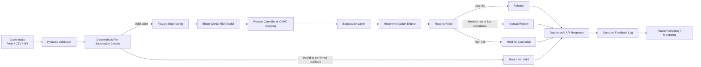

# ClaimShield AI — Architecture Specification

## 1. System Overview

ClaimShield AI is a pre-submission intelligence engine designed to intercept preventable claim denials before transmission to healthcare payers. Traditional revenue cycle management (RCM) workflows discover defects only after weeks of adjudication when an Electronic Remittance Advice (ERA / X12 835) arrives with denial remark codes. 

ClaimShield AI shifts denial detection upstream into the provider billing boundary:

```text
Claim Intake (EHR / Form / CSV)
   │
   ▼
Deterministic Validation Layer
   ├── Hard Blocks (Schema, Negative Amounts, Duplicates, Unknown Payers) ──► BLOCK_UNTIL_VALID
   └── Non-Blocking Warnings (Unknown Codes, Stale Eligibility)
   │
   ▼
Pre-Submission Feature Extraction Pipeline (Strict Leakage Audit Guard)
   │
   ▼
Stage 1: Binary Denial-Risk Estimator (HistGradientBoosting / RandomForest)
   ├── Denial Probability p ∈ [0.0, 1.0]
   └── Model Confidence Metric
   │
   ▼
Stage 2: CARC Denial Reason Categorization (Multiclass Forest / Transparent Mapping)
   ├── Predicted Reason Code (e.g. CO-197, CO-29, CO-27)
   └── Reason Confidence
   │
   ▼
Explainability & Recommendation Layer
   ├── Top-3 Risk Factor Directional Contributions
   └── Plain-English Actionable Remediation Checklist
   │
   ▼
Policy-Driven Routing Engine
   ├── Risk < 0.30 ─────────────────────────────► RELEASE
   ├── 0.30 <= Risk <= 0.70 or Low Conf ────────► REVIEW
   └── Risk > 0.70 ─────────────────────────────► HOLD_FOR_CORRECTION
```

---

## 2. Architecture Diagram



---

## 3. Separation of Concerns

1. **Deterministic Validation ≠ Probabilistic Prediction**:
   - Hard failures such as negative dollar amounts, malformed service dates, unknown payer IDs, or confirmed duplicates never reach the ML inference stage. They route deterministically to `BLOCK_UNTIL_VALID` (or HTTP 404/409).
   - Unknown clinical codes produce non-blocking warnings and use generalized baseline features rather than crashing.
2. **Pre-Submission Feature Boundary**:
   - Zero post-submission adjudication information (e.g., paid amount, remittance date, actual denial code) is allowed into the feature matrix.
   - Programmatically audited via `backend/ml/preprocessor.py` and unit-tested in `tests/test_leakage.py`.
3. **Transparent Explainability**:
   - Feature importances and directional contributions (`increases_risk` / `decreases_risk`) are translated into billing-specialist terminology (e.g. Box 23 / 837P Loop 2300 prior authorization instructions).

---

## 4. Production Integration Boundary (Future State)

In an enterprise hospital network:
- **Intake**: Ingestion of X12 837P (Professional) and 837I (Institutional) flat files from clearinghouses or EHRs (Epic Resolute, Cerner Soarian).
- **Outcomes**: Ingestion of X12 835 ERA remittance feeds to automatically close the feedback loop for active model retraining and drift detection.
- **Compliance**: Integration behind HIPAA Business Associate Agreements (BAA), TLS 1.3 encryption in transit, AES-256 at rest, role-based access control (RBAC), and SOC2 Type II audit trails.
