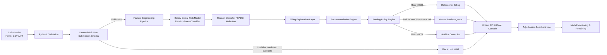

# ClaimShield AI — System Architecture Specification

## 1. High-Level Pipeline Architecture

ClaimShield AI functions as an upstream pre-submission decision-support intelligence engine positioned between the Electronic Health Record (EHR) / Practice Management (PM) claim generation stage and the Electronic Data Interchange (EDI) clearinghouse dispatch layer.

## 2. Component Breakdown

### 2.1 Deterministic Pre-Submission Validation Layer
- **Responsibility:** Executes strict syntax and reference integrity checks prior to machine-learning inference.
- **Failures Handled (`BLOCK_UNTIL_VALID`):**
  - Missing mandatory fields (claim ID, patient ID, procedure codes, diagnosis codes)
  - Negative or zero claim charges
  - Future service dates
  - Unrecognized clearinghouse destination payers (returns HTTP 404)
  - Confirmed duplicate claim submissions (returns HTTP 409)
- **Non-Fatal Warnings:**
  - Unverified eligibility or stale eligibility checks (>30 days old)
  - Incomplete documentation flags
  - Unknown CPT/ICD codes outside the reference dictionary
  - High dollar charges (> $2,500)

### 2.2 Feature Engineering & Leakage Guard
- **Pre-Submission Feature Extraction:** Transforms raw clinical and operational attributes into a standardized numeric matrix of 27 features (one-hot encoded payers, specialty indicators, interaction flags such as `prior_auth_mismatch`).
- **Leakage Prevention:** Explicit assertion verifying that post-submission fields (`will_be_denied`, `actual_status`, `payment_amount`, `remittance_date`, `appeal_outcome`) never enter the feature matrix.

### 2.3 Machine Learning Layer
- **Stage 1 (Binary Risk Model):** Calibrated `RandomForestClassifier` (100 estimators, max depth 8, balanced class weighting) predicting continuous denial probability $p \in [0.0, 1.0]$.
- **Stage 2 (CARC Reason Attribution):** Secondary classifier trained exclusively on denied claims mapping feature attribution vectors to the 8 primary CARC categories.
- **Model Confidence Calculation:** Assesses prediction stability based on distance from the decision boundary: $c = 0.50 + |p - 0.50|$.

### 2.4 Explanation & Recommendation Layer
- **Billing Language Translation:** Converts raw feature importances and factor deltas into intuitive clinical and operational explanations.
- **Prescriptive Recommendation Engine:** Provides prioritized step-by-step guidance on remediating the flagged defect (e.g. obtaining prior authorization numbers, executing 270/271 inquiries, appending NCCI modifiers).

### 2.5 Routing Policy Engine
- **Configurable Risk Thresholds:**
  - `RELEASE`: $p < 0.30$ and $c \ge 0.55$
  - `REVIEW`: $0.30 \le p \le 0.70$ or $c < 0.55$
  - `HOLD_FOR_CORRECTION`: $p > 0.70$
  - `BLOCK_UNTIL_VALID`: Deterministic validation error or duplicate
- **Policy Version Tracking:** Emits `policy_version` (`routing-v1.0`) with every evaluation for auditability.
